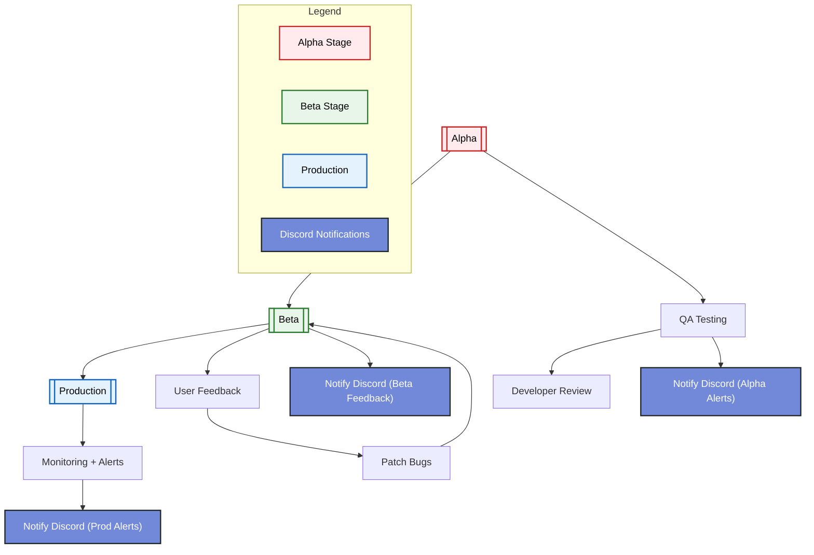

# **🚀 Alpha Indicator**

A Modular, AI-assisted trading research engine.
[](https://postimg.cc/QHYT4kss)

## 🔧 Technologies & Tools

[](https://www.cyfrin.io/)
[](https://pypi.org/project/finta/)
[](https://www.python.org/)
[](https://www.gadget-savvy.com/)

---


Here’s the full **design map** for the `AlphaEdge` system — written as a **clean blueprint for GPT-based implementation**, so it can be to power a custom GPT or instruction-following agent.

---

## 🧠 AlphaEdge – Predictive Trading Signal Engine


---

## ⚡ What is AlphaEdge?

**AlphaEdge** is a modular, AI-assisted research engine designed to:

> 🔍 **Extract alpha signals** from OHLCV data using technical indicators
> 🧠 **Train ML models** to predict trade opportunities or rank arbitrage paths
> 📊 **Backtest strategies** like RSI/EMA crossovers with full statistics
> 📈 (Optional) **Visualize signals** via a GUI dashboard
> 📡 (Optional) **Send alerts** to Telegram or Discord when a strategy triggers

---

## 🧠 What Does It Do?

### 1. **Feature Extraction**

* Uses [Finta](https://github.com/peerchemist/finta) to compute indicators like:

  * RSI, EMA, MACD, OBV, Bollinger Bands
* Converts raw OHLCV into a dataset with **rich, predictive features**

---

### 2. **Model Training**

* Trains ML models (e.g. XGBoost) to:

  * Predict price movements
  * Classify good vs. bad trade setups
  * Score or rank arbitrage paths (from your main system)

---

### 3. **Backtesting Engine**

* Simulates strategy logic (entry/exit, SL/TP)
* Runs historical performance checks using:

  * TA rules (`RSI < 30`)
  * Or model predictions

---

### 4. **Signal Ranking for Arbitrage**

* Takes arbitrage paths from your main system
* Scores them using the ML model trained in AlphaEdge
* Ranks by probability of profit, volatility window, or execution priority

---

### 5. **GUI Dashboard (Optional)**

* Upload CSV or fetch OHLCV via `yfinance`
* Auto-generate charts of RSI, MACD, EMA crossover
* Explore indicator trends + enriched features

---

### 6. **Signal Alerts**

* Sends Telegram alerts when:

  * A strategy condition triggers
  * A model predicts a high-probability opportunity
* Discord integration optional

---




## 🔧 Why Build It?

Because my arbitrage system is real-time, reactive, and execution-focused.
AlphaEdge gives you:

* 🔬 A **research sandbox**
* 🧠 **Predictive models** that can later plug into the arbitrage engine
* 🪙 A **future alpha source** to find profitable trades faster than others

---


### 📁 Project Structure

```
alphaedge/
├── main.py                    # Entry point
├── data/                      # Raw + enriched OHLCV
│   └── eth_usdc_ohlcv.csv
├── engine/                    # Core logic
│   ├── feature_engine.py      # TA/indicator calculations (Finta)
│   ├── models.py              # ML models (e.g. XGBoost, LSTM)
│   ├── strategy_runner.py     # Signal logic and backtest loop
│   ├── data_loader.py         # Read/normalize OHLCV
│   └── signals.py             # Rule-based strategies (e.g. RSI cross)
├── ui/                        # Optional GUI with Streamlit or Dash
│   └── dashboard.py
└── tests/                     # Full test coverage
    ├── test_features.py
    ├── test_backtest.py
    └── test_models.py
```

---

### 🧱 Class + Function Map (GPT-Ready)

#### 🔹 `class FeatureEngine` (`feature_engine.py`)

Builds indicator features using Finta.

```python
class FeatureEngine:
    def __init__(self, df: pd.DataFrame):
        self.df = df.copy()

    def add_indicators(self) -> pd.DataFrame:
        """Add EMA, RSI, MACD, OBV, etc. to DataFrame."""
        ...
    
    def clean(self) -> pd.DataFrame:
        """Drop NaNs and reset index."""
        ...
```

---

#### 🔹 `class StrategyRunner` (`strategy_runner.py`)

Backtests rules or model outputs.

```python
class StrategyRunner:
    def __init__(self, df: pd.DataFrame):
        self.df = df

    def run_backtest(self, entry_rule: str, exit_rule: str, sl: float, tp: float) -> dict:
        """Simulate trades based on entry/exit rules and return stats."""
        ...

    def generate_equity_curve(self) -> pd.Series:
        """Return cumulative PnL over time."""
        ...
```

---

#### 🔹 `class AlphaModel` (`models.py`)

Handles ML training/prediction.

```python
class AlphaModel:
    def __init__(self, model_type: str = "xgboost"):
        self.model = None
        self.model_type = model_type

    def train(self, X: pd.DataFrame, y: pd.Series):
        """Train the ML model on TA features."""
        ...

    def predict(self, X: pd.DataFrame) -> pd.Series:
        """Return predicted signal (buy/sell/hold)."""
        ...

    def save(self, path: str):
        ...

    def load(self, path: str):
        ...
```

---

#### 🔹 `class SignalBook` (`signals.py`)

Contains common TA-based signals.

```python
class SignalBook:
    @staticmethod
    def rsi_cross(df: pd.DataFrame, low: int = 30, high: int = 70) -> pd.Series:
        """Return entry signal when RSI crosses thresholds."""
        ...

    @staticmethod
    def ema_crossover(df: pd.DataFrame, fast: int = 10, slow: int = 50) -> pd.Series:
        """Returns signal where fast EMA crosses above slow EMA."""
        ...
```

---

#### 🔹 `class OHLCVLoader` (`data_loader.py`)

Reads and formats input OHLCV.

```python
class OHLCVLoader:
    def __init__(self, file_path: str):
        self.file_path = file_path

    def load(self) -> pd.DataFrame:
        """Read CSV and ensure columns [open, high, low, close, volume]."""
        ...
```

---

#### 🔹 `dashboard.py` (Optional GUI)

```python
def render_dashboard():
    """Show indicators and signal overlay with Streamlit/Dash."""
    ...
```

---

### 🧠 Model Use Cases (AlphaEdge + Arbitrage System)

| Use Case                       | Input                          | Output                 |
| ------------------------------ | ------------------------------ | ---------------------- |
| Rank Arbitrage Paths           | TA features from price/volume  | ML score               |
| Predict Token Volatility Spike | Rolling OHLCV + indicators     | Classification (↑/↓/→) |
| Backtest RSI/EMA strategies    | Clean DataFrame + rules        | Equity curve, stats    |
| Train Path Filter Model        | Arbitrage path + Finta context | Good/Bad label         |

---
